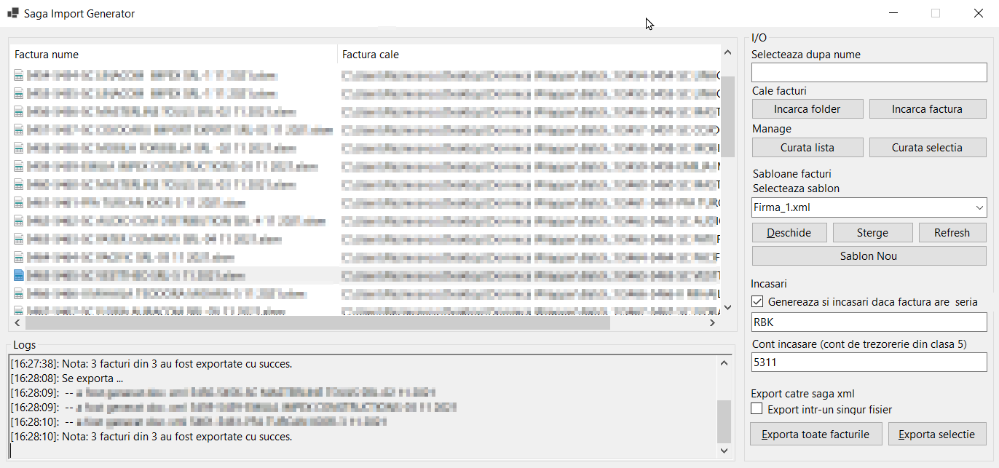

# FlexExcelToSagaXmlImporter-pub
Another tool used in the bookkeeping trade.


## About The Project
Use this tool when you have many standardized excel documents which contain/provide cell data that you need. 
This tool will help you extract required data from such documents using a common template which helps the program determine which excel cells are needed and which are not. Exported data will follow strictly the format of the template.

## Gallery view
<br>


## Template example
```xml
<Facturi sheets="Factura chitanta;date factura">
	<Factura>
		<Antet>
			<FurnizorNume cell-bound="true" sheet-id="0">C2</FurnizorNume>
			<FurnizorCIF cell-bound="true" no-spaces="true" sheet-id="0">C4</FurnizorCIF>
			<FurnizorNrRegCom cell-bound="true" no-spaces="true" sheet-id="0">C3</FurnizorNrRegCom>
			<FurnizorCapital cell-bound="true" numeric="true" sheet-id="0">C9</FurnizorCapital>
			<FurnizorTara>RO</FurnizorTara>
			<FurnizorJudet cell-bound="true" sheet-id="0">C6</FurnizorJudet>
			<FurnizorAdresa cell-bound="true" sheet-id="0">C5</FurnizorAdresa>
			<FurnizorTelefon cell-bound="true" sheet-id="0">C10</FurnizorTelefon>
			<FurnizorMail cell-bound="true" sheet-id="0" trim-start="email:">A11</FurnizorMail>
			<FurnizorBanca cell-bound="true" sheet-id="0">C8</FurnizorBanca>
			<FurnizorIBAN cell-bound="true" sheet-id="0">C7</FurnizorIBAN>
			<FurnizorInformatiiSuplimentare cell-bound="true" join-str=";" sheet-id="0">C10;A11;C8
			</FurnizorInformatiiSuplimentare>
			<ClientNume cell-bound="true" sheet-id="1">B5</ClientNume>
			<ClientInformatiiSuplimentare cell-bound="true" sheet-id="1">B11</ClientInformatiiSuplimentare>
			<ClientCIF cell-bound="true" no-spaces="true" sheet-id="1">B7</ClientCIF>
			<ClientNrRegCom cell-bound="true" no-spaces="true" sheet-id="1">B6</ClientNrRegCom>
			<ClientJudet cell-bound="true" sheet-id="1">B9</ClientJudet>
			<ClientTara>RO</ClientTara>
			<ClientAdresa cell-bound="true" sheet-id="1">B8</ClientAdresa>
			<ClientBanca cell-bound="true" sheet-id="1">B11</ClientBanca>
			<ClientIBAN cell-bound="true" sheet-id="1">B10</ClientIBAN>
			<ClientTelefon/>
			<ClientEmail/>
			<FacturaNumar cell-bound="true" sheet-id="0">H3;J3</FacturaNumar>
			<FacturaData cell-bound="true" date="true" sheet-id="1">B1</FacturaData>
			<FacturaScadenta cell-bound="true" date="true" sheet-id="1">B1</FacturaScadenta>
			<FacturaTaxareInversa>Nu</FacturaTaxareInversa>
			<FacturaTVAIncasare>Nu</FacturaTVAIncasare>
			<FacturaInformatiiSuplimentare/>
			<FacturaMoneda>RON</FacturaMoneda>
			<FacturaGreutate>0</FacturaGreutate>
			<FacturaAccize>0</FacturaAccize>
			<FacturaID>!2557ec2a-6634-4a4c-b4b7-fdf720dfa1c1!</FacturaID>
		</Antet>
		<Detalii>
			<Continut>
				<Linie>
					<LinieNrCrt>1</LinieNrCrt>
					<Descriere>Factura descriere</Descriere>
					<CodBare/>
					<InformatiiSuplimentare/>
					<UM>BUC</UM>
					<ProcTVA cell-bound="true" numeric="true" sheet-id="0">A13</ProcTVA>
					<Cantitate>1</Cantitate>
					<Pret cell-bound="true" sheet-id="1">G48</Pret>
					<Valoare cell-bound="true" sheet-id="1">G48</Valoare>
					<TVA cell-bound="true" sheet-id="1">H48</TVA>
					<Cont>707.01</Cont>
				</Linie>
			</Continut>
		</Detalii>
		<Sumar>
			<TotalValoare cell-bound="true" sheet-id="1">G48</TotalValoare>
			<TotalTVA cell-bound="true" sheet-id="1">H48</TotalTVA>
			<Total cell-bound="true" sheet-id="1">H49</Total>
			<LinkPlata/>
		</Sumar>
	</Factura>
</Facturi>
```
## Xml attributes
The tool exposes some attributes that are automatically removed after parsing and fixing to-excel-cell references.
Such attributes are:
* `sheets="sheet_1;sheet_2;...;sheet_n"` - must be placed on root element and defines excel sheets
* `sheet-id="k"`						 - cell data will be extracted from 'k' sheet in `sheets` list
* `cell-bound="true|false"` - tag content will contain the value at specified excel cell
* `no-spaces="true|false"`  - tag content will contain no spaces
* `numeric="true|false"`    - tag content will contain only numbers
* `date="true|false"`       - tag content will be date formated
* `join-str=""`			  - if tag content specifies multiple excel cell references separated by `;` then each cell data will be appended to the other via the attribute string unifier


## A simple tool  
'Tis but a simple tool that helps automate that wich can be automated.
Note that cell data is not escaped and therefore it is your responsibility to treat the cases where escaping is needed.  